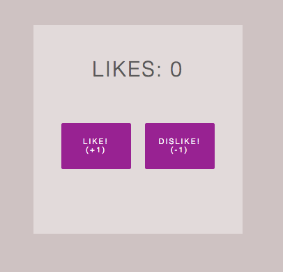

# React In Theory

### Goals of This Lesson
  - Build a basic web app from scratch using React.  
  Final product will look like this:

## There Are A Few Starting Points to This Lesson
  1. Basic Configuration
    - To build your app from scratch: `git checkout basic-config`
    - To work with a basic setup and start writing React: `git checkout basic-config-from-react`
  2. With HTMLWebpackPlugin & Sass:
    - To build your app from scratch: `git checkout from-scratch`.
    - To work with a basic setup and start writing React: `git checkout from-react`  

  **NOTE** If you choose not to start from scratch, make sure to run `npm install` to install all of the dependencies that have been used up until that point.
